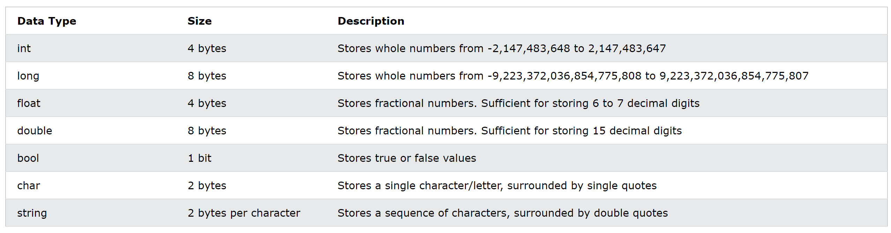

# C# Variable

## 基本型別



## 常數與var(自動判斷資料型別)宣告

```C#
const double Pi = 3.14;
var a = 1; //自動將a定義為int
var b = "hello";//自動將b定義為string
```

## 型別轉換

```C#
int b= (int)1.0; //把1.0強制轉成int

string a = "1234";
int b = Convert.ToInt32(a);//把a這個字串轉成int

string c = "2019/09/05";
DateTime d = Convert.ToDateTime(c);//把c這個字串轉成時間物件

string a = "1234";
int b = int.Parse(a);//把a這個字串轉成int

DateTime z = new DateTime(2019,9,5);
string y = z.ToString();//把DateTime形式轉成字串
```

## 字串

- 空字串
  ```C#
  string empty1 = "";
  string empty2 = String.Empty;
  ```

- 字串長度
  ```C#
  int empty1_len = empty1.Length
  ```

- 跳脫字元: '\'
  ```C#
  string ai = "C:\Users\user\Desktop";  //會報錯
  string ai = "C:\\Users\\user\\Desktop";  //OK了!
  ```

- @符號: 字串一開頭(雙引號""外)，加上一個@，來代表後面這個字串的\都不是跳脫字元。
  ```C#
  string ai = "C:\Users\user\Desktop"; //會報錯
  string ai = @"C:\Users\user\Desktop"; //加個@ OK了
  ```

## Empty & null
In C#, a variable's value is **null** if it is not set, or if it has been explicitly set to null. A null value typically means the value is **not known**, or **has not yet been set**, and is frequently a source of errors in programs.<br>
An **empty** string is simply a string with a **length of zero**. It's a valid instance of a string, but one that currently has no characters in it. 


Refer:
- [C#變數與變數宣告、常數與常數宣告、var、型別轉換](https://ithelp.ithome.com.tw/articles/10213219)
- [C#字串與跳脫字元](https://ithelp.ithome.com.tw/articles/10213867)
- [Working with Strings](https://github.com/dotnet/training-tutorials/blob/master/content/csharp/getting-started/strings.md)
- [C# Data Types](https://www.w3schools.com/cs/cs_data_types.php)