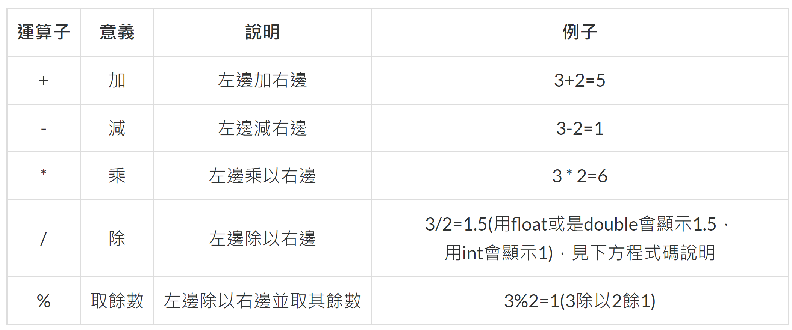
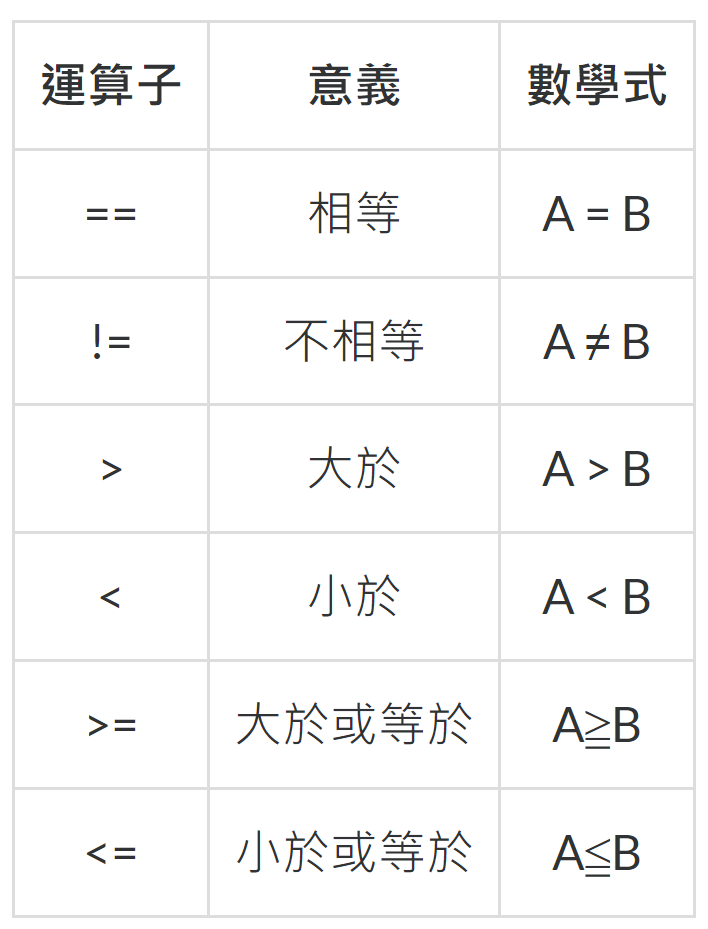

# Operater

根據運算子的功能，可以區分為以下幾種

1. 算術運算子
2. 關係運算子(等號比較運算子、比較運算子)
3. 邏輯運算子、條件邏輯運算子
4. 位元運算子(二進位制)
5. 移位運算子(二進位制)
6. 指定運算子
7. 條件運算子

## 算術運算子

## 關係運算子

傳回的結果為布林值:True或False

## 邏輯運算子

## 位元運算子

## 移位運算子

## 指定運算子

## 條件運算子
