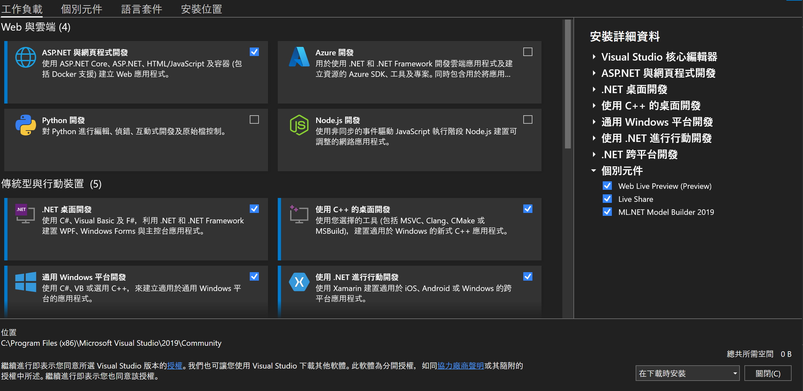

# Hello ASP.NET

## Intro. ASP
- ASP stands for Active Server Pages（動態服務器頁面）
- ASP is a development framework for building web pages.
- ASP 副檔名為 **.asp** ，通常是用 VBScript 編寫

## Intro. ASP.NET
- ASP.NET 是新一代 ASP, 與 ASP 不兼容
- ASP.NET 頁面需經過編譯，故效能比ASP 快
- ASP.NET 由微軟在.NET Framework框架中所提供的，該模組封裝在System.Web.dll 文件中
- ASP.NET 副檔名為 **.aspx** ，通常是用 VB (Visual Basic) or C# 編寫
- ASP.NET 提供三種不同的開發模式：Web Pages、MVC（Model View Controller）、Web Forms.
- ASP.NET Razor 是一種將 server 程式碼嵌入到 ASP.NET 網頁中的標記語法

<br>

## ASP.NET 安裝與建置
- Visual Studio 2019 + ASP.NET
  

- Open Visual Studio 2019 ASP.NET Web應用程式

  

  

- 先選擇空白專案, 結果如下圖

  

## HELLO WORLD

- 新增新項目- Web- Web表單( 取名 index.aspx )

  

  

- .aspx:  Code File，或稱為ASP.NET HTML，主要儲放版面設計相關的程式碼，修改程式碼後不用整體編譯，只重新整理頁面就可以看到效果。

  

- .aspx.cs: Code Behind File後置程式碼，主要儲放含運算程序及連接資料庫相關的程式碼。是微軟在伺服器端運行的動態網頁檔案，須經由編譯而產生頁面。

  

- 在 index.aspx.cs 新增:

  ```C#
  Response.Write("Hello World : ASP.NET <br>");
  ```

- Run Project

  

## The Error Note in VS2019

- https -> http: 右鍵專案，選擇**屬性/Web**, 直接修改URL

  

- HTTP Error 403.14 - Forbidden<br>

  Modify **Web.config**

  ```XML
  <system.webServer>
    <directoryBrowse enabled="true" />
  </system.webServer>
  ```

## 流程圖 (See [refer](https://ithelp.ithome.com.tw/articles/10213180))


Refer: 
- [Visual studio 2019安裝 + ASP.NET Web Form基礎介紹 + 黑夜模式(護眼)](https://ithelp.ithome.com.tw/articles/10213180)

- [ASP.NET 簡介](https://www.runoob.com/aspnet/aspnet.html)

- [ASP and ASP.NET Tutorials](https://www.w3schools.com/asp/default.asp)

- [HTTP Error 403.14 - Forbidden 的錯誤發生時解決方式](https://dotblogs.com.tw/junghsi/2020/05/28/074243)
