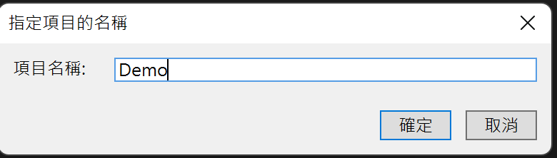
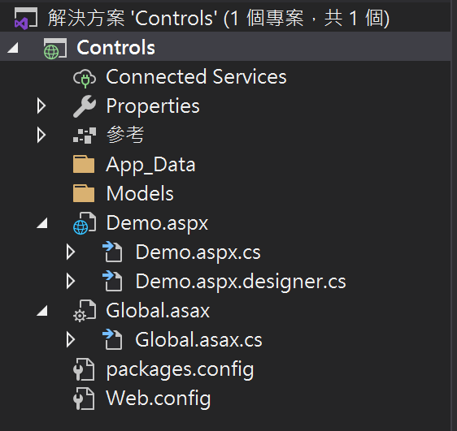

# Controls

在本次範例中，將創建一個表單，具有下列功能:

- Label
- List box
- RadioButton
- Checkbox
- Button

## Create new project

- Base on [Hello ASP.NET](01.md) steps, and add the new form

  

  <p>

  

  <p>

  

  <p>

  

- 開啟 Demo.aspx

<br>

## 修改 ASP.NET HTML: Demo.aspx

- Label

  ```html
  <asp:Label ID="Label1" runat="server" Text="Name"></asp:Label>
  ```

- TextBox

  ```html
  <asp:TextBox ID="txtName" runat="server" Text=""></asp:TextBox>
  ```

- List box
  
  ```html
  <asp:ListBox ID="lstLocation" runat="server">
    <asp:ListItem>item1</asp:ListItem>
    <asp:ListItem>item2</asp:ListItem>
    <asp:ListItem>item3</asp:ListItem>
    <asp:ListItem>item4</asp:ListItem>
  </asp:ListBox>
  ```

- Radio button (單選)

  ```html
  <asp:RadioButton id="red" Text="Red" Checked="True" GroupName="colors" runat="server"/>
  <asp:RadioButton id="green" Text="Green" GroupName="colors" runat="server"/>
  <asp:RadioButton id="blue" Text="Blue" GroupName="colors" runat="server"/>
  ```

- Check box (多選)

  ```html
  <asp:CheckBox id="CheckBox1" runat="server"  />check01
  <asp:CheckBox id="CheckBox2" runat="server"  />check02
  <asp:CheckBox id="CheckBox3" runat="server"  />check03
  ```

- Button

  ```html
  <asp:Button id="btnSubmit_Click" Text="Submit" runat="server" />
  ```

- The full code see [Sample](./Controls/Controls/Controls/Demo.aspx)

  

## 事件處理程序(Event Handler)

以點擊 button 為例

- 修改 ASP.NET HTML 事件處理

  ```html
  <asp:Button id="btnSubmit" Text="Submit" runat="server" OnClick="btnSubmit_Click" />
  ```

- 新增後端程式碼 (Demo.aspx.cs)

  ```C#
  protected void btnSubmit_Click(object sender, EventArgs e) {
    Response.Write(txtName.Text + " welcome~ </p><div></div>");
  }
  ```

- Run Code

  


<br>

Refer:

- [ASP.NET RadioButton 控件](https://www.runoob.com/aspnet/control-radiobutton.html)

- [工具箱常用的伺服器控制項 - CheckBox](https://ithelp.ithome.com.tw/articles/10222031)

- [Button.Click 事件](https://docs.microsoft.com/zh-tw/dotnet/api/system.web.ui.webcontrols.button.click?view=netframework-4.8)