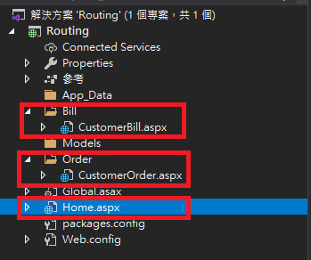
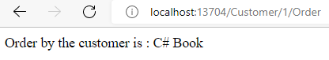
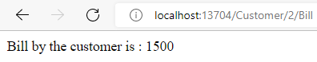

# Route

- 創建新項目與資料夾

  資料夾:  “Bill” and “Order” and kept two .aspx files in both of them

  主網頁: Home.aspx

  

  <p>

- 修改 Global.asax

  Global.asax: 全域應用程式類別, 用於處理驗證授權、過濾器、路由設定等

  新增 System.Web.Routing Class

  ```C#
  using System.Web.Routing;
  ```
  
  <p>

- 新增路由目錄, 修改 Global.asax

  ```C#
  protected void Application_Start(object sender, EventArgs e){
            RouteTable.Routes.MapPageRoute(
                "CustomerOrder",
                "Customer/{id}/Order",
                "~/Order/CustomerOrder.aspx");

            RouteTable.Routes.MapPageRoute(
                "CustomerBill",
                "Customer/{id}/Bill",
                "~/Bill/CustomerBill.aspx");
        }

  // public Route MapPageRoute(string routeName, string routeUrl, string physicalFile);
  ```

  If URL: Customer/1/Order, it should route the “customerBill.aspx” page which is located under the “Bill” directory

  <p>

- Implement Order page: 修改 CustomerOrder.aspx.cs

  - 新增假訂單資料庫模組

    ```C#
    public class ClsCustomerOrder{
        Dictionary<int, string> Order = new Dictionary<int, string>();
        public ClsCustomerOrder(){
            Order.Add(1, "C# Book");
            Order.Add(2, "Java Book");
            Order.Add(3, "PHP Book");
        }
        public string GetOrder(int id){
            return Order[id];
        }
    }
    ```

  - 修改後端頁面加載函式

    ```C#
    protected void Page_Load(object sender, EventArgs e){
        //capturing the current URL
        string[] url = HttpContext.Current.Request.Url.AbsolutePath.Split('/');

            ClsCustomerOrder Order = new ClsCustomerOrder();
            Response.Write("Order by the customer is : " + Order.GetOrder(Convert.ToInt32(url[2])));
        }
    ```

  - 測試網頁結果

    

- Implement the Billing page: 修改 CustomerBill.aspx.cs

  - 新增假帳單資料庫模組

    ```C#
    public class ClsCustomerBill{
        Dictionary<int, int> Order = new Dictionary<int, int>();
        public ClsCustomerBill(){
            Order.Add(1, 1000);
            Order.Add(2, 1500);
            Order.Add(3, 2400);
        }
        public int GetOrder(int id){
            return Order[id];
        }
    }
    ```

  - 修改後端頁面加載函式

    ```C#
    protected void Page_Load(object sender, EventArgs e){
        string[] url = HttpContext.Current.Request.Url.AbsolutePath.Split('/');
        ClsCustomerBill Order = new ClsCustomerBill();
        Response.Write("Bill by the customer is : " + Order.GetOrder(Convert.ToInt32(url[2])));
    }
    ```

  - 測試網頁結果

    

Refer:

- [Routing in ASP.Net Web Form Application](https://www.c-sharpcorner.com/UploadFile/dacca2/routing-in-Asp-Net-web-form-application/)

- [MVC生命週期與Global.asax](https://jiahao831123.medium.com/%E7%AD%86%E8%A8%98-mvc-%E7%94%9F%E5%91%BD%E9%80%B1%E6%9C%9F%E8%88%87global-asax-d45d61764204)