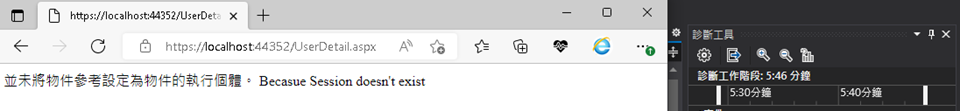

# Session

- 資料存放在server的記憶體中
- Session的內容鎖定同一瀏覽器，並不是所有user都共用。
- 預設生命週期為20分鐘
- 存放的資料內容為Object資料型別，讀取時需要轉換為適當的型別使用
- 資料量大小無限制，以server的記憶體大小而定


## 設置 session timeout

Web.Config

```xml
<configuration>  
  <system.web>      
    <sessionState mode="InProc" timeout="5"></sessionState>  
  </system.web>  
</configuration>  
```

## Create a web form: Login

Login.aspx

```html
<form id="form1" runat="server">
    <div>
        Name : <asp:TextBox ID="txtName" runat="server"></asp:TextBox><br />  
        <asp:Button ID="btnSubmit" runat="server" Text="Submit" OnClick="btnSubmit_Click" />
    </div>
</form>
```

Login.aspx.cs

```c#
protected void btnSubmit_Click(object sender, EventArgs e)
    Session["Name"] = txtName.Text;
    Response.Redirect("UserDetail.aspx");
}
```

## Crete a web from to test session

```C#
protected void Page_Load(object sender, EventArgs e){
    try{
        string name = Session["Name"].ToString();
        Response.Write(string.Format("User name is :{0}", name));
    }
    catch (NullReferenceException ex){
        Response.Write(ex.Message + " Becasue Session doesn't exist");
    }
}
```

## 測試5分鐘後結果




<br>

Refer:

- [InProc Session State Mode in ASP.Net](https://www.c-sharpcorner.com/UploadFile/3d39b4/inproc-session-state-mode-in-Asp-Net/#:~:text=The%20InProc%20Session%20State%20Mode%20stores%20session%20data,in%20the%20application%20domain%20of%20the%20web%20server.)

- [ASP.NET 你今天想怎麼保存資訊?](https://ithelp.ithome.com.tw/articles/10222885)

