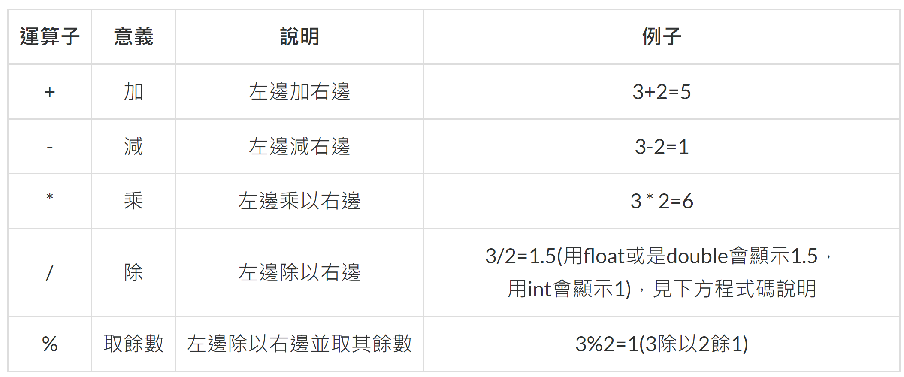
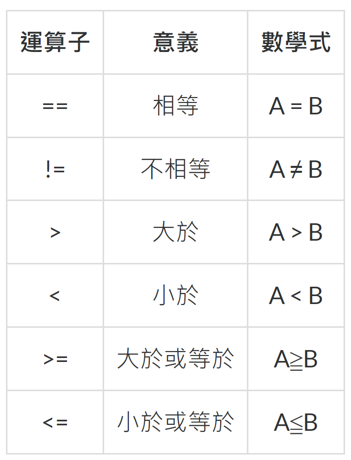
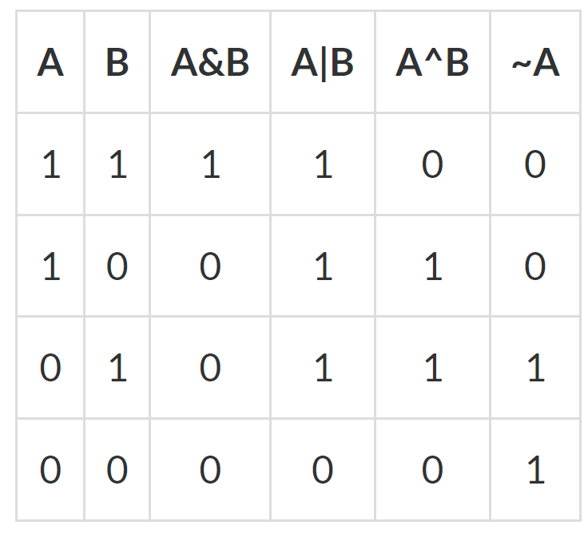

# Operater

根據運算子的功能，可以區分為以下幾種

1. 算術運算子
2. 關係運算子(等號比較運算子、比較運算子)
3. 邏輯運算子、條件邏輯運算子
4. 位元運算子(二進位制)
5. 移位運算子(二進位制)

## 算術運算子

## 關係運算子

傳回的結果為布林值:True或False

## 邏輯運算子

| 運算子 | 意義 | 說明 |
|-------|----- |----- |
| !     | 否定  | 若A本身為真，!A為假; 若A本身為假，!A為真。|
| ^     | XOR  | 邏輯互斥 |
| &&    | 且   | A&& B,當A、B都為真時，結果才會為真 |
| \|\|    | 或   | A \|\| B,當A、B其中一個為真時，結果為真 |

## 位元運算子
以下運算子會先將運算元換成0和1的二進位制，再做二進位制的布林運算。

| 運算子 | 意義 | 說明 |
|-------|----- |----- |
| \|    | 或(Or)  | A \| B,當A、B其中一個為真時，結果為真 |
| ^     | XOr(互斥)  | 當A跟B都是或都是1，結果為0，否則結果為1 |
| &    | 且(And)   | A & B,當A、B都為真時，結果才會為真 |
| ~    | 非(Not)   | ~A，取A的二進位制後完全相反 |

## 移位運算子

| 運算子 | 說明 |
|------- |----- |
| <<    | 位元左移  |
| >>     | 位元右移  |

Refer:
- [C#運算式與運算子(上)](https://ithelp.ithome.com.tw/articles/10213220)
- [C#運算式與運算子(下)](https://ithelp.ithome.com.tw/articles/10214404)
- [用C#算數學!](https://ithelp.ithome.com.tw/articles/10214418)

